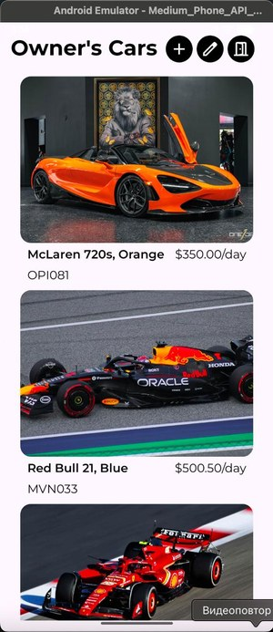
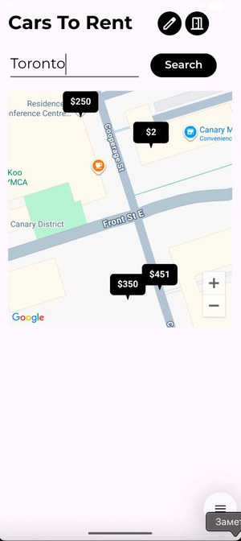
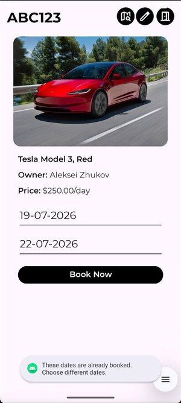
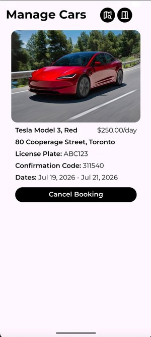

# Car Rental App 🚗

A peer‑to‑peer car‑rental Android app inspired by **Turo**, built in **Kotlin**. Car owners list their vehicles, renters find and book them on an interactive map, and a booking engine guarantees no two people can rent the same car on overlapping dates.

> Coursework project — George Brown College, Mobile Application Development. ~2,100 lines of Kotlin across 18 files.

---

## 📱 Screenshots

<table>
  <tr>
    <td align="center"><br/><sub><b>Login</b></sub></td>
    <td align="center"><br/><sub><b>Register (Owner / Renter)</b></sub></td>
    <td align="center"><br/><sub><b>Owner's cars</b></sub></td>
  </tr>
  <tr>
    <td align="center"><br/><sub><b>Map search</b></sub></td>
    <td align="center"><br/><sub><b>Booking + overlap check</b></sub></td>
    <td align="center"><br/><sub><b>Manage bookings</b></sub></td>
  </tr>
</table>

---

## ✨ Features

- **Two user roles** — `OWNER` and `RENTER`, each with its own navigation and available actions, plus a guest (unauthenticated) entry point.
- **Firebase Authentication** — email/password registration and login.
- **Cloud Firestore** — stores users, cars and bookings.
- **Interactive map search** — browse available cars as markers on **Google Maps**.
- **Listings management** — owners create listings, view their fleet and manage incoming bookings.
- **Photo uploads** — car images loaded efficiently with **Glide**.
- **Double‑booking prevention** — a date‑overlap algorithm blocks reservations whose date ranges collide with existing bookings.
- **Booking confirmation codes** — each reservation gets a unique confirmation code.

---

## 🏗️ Architecture

```
com.example.carrentalapp/
  MainActivity.kt            entry point + role-based routing
  RegisterActivity.kt        Firebase Auth sign-up
  SearchCarsActivity.kt      Google Maps search for renters
  CarRentActivity.kt         car details & booking
  CreateListingActivity.kt   owners publish a car
  OwnerCarsActivity.kt       owner's fleet
  ManageBookingsActivity.kt  view / cancel bookings
  adapters/                  RecyclerView adapters (bookings, owner cars)
  models/
    data/  user/  car/  booking/   domain models (User, Car, Booking, CarMarker)
    types/ user/                    UserType enum (OWNER / RENTER)
  utils/  DateUtils.kt              date parsing & Firestore Timestamp helpers
```

The domain models are documented with KDoc and cleanly separated from the Activity/UI layer. `UserSession` keeps the current authenticated user in one place, and role‑based navigation is driven by the `UserType` enum.

---

## 🛠️ Tech Stack

| Area | Technologies |
|------|-------------|
| Language | Kotlin |
| UI | Android SDK, ConstraintLayout, RecyclerView, Material Components |
| Backend | Firebase Authentication, Cloud Firestore |
| Maps | Google Maps SDK for Android |
| Images | Glide |
| Build | Gradle (Kotlin DSL), version catalog |

**minSdk** 24 · **targetSdk / compileSdk** 36

---

## 🚀 Getting Started

### Prerequisites
- Android Studio (latest stable)
- JDK 11+
- A Firebase project
- A Google Maps API key

### Setup
1. Clone the repository:
   ```bash
   git clone https://github.com/Taburetochkin/Car-Rental-App.git
   ```
2. Create a Firebase project, enable **Authentication** (Email/Password) and **Cloud Firestore**.
3. Add your `google-services.json` to the `app/` directory.
4. Add your Google Maps API key to the manifest (or `local.properties`, depending on your setup).
5. Open in Android Studio, sync Gradle, and run.

---

## 🎯 How It Works

**Roles.** On login the app reads the user's `UserType` and routes owners and renters to different flows — owners manage listings and bookings, renters search and reserve.

**No double bookings.** Before a reservation is confirmed, the app checks the requested `startDate`–`endDate` range against all existing bookings for that car. If the ranges overlap, the booking is rejected — so a single vehicle can never be reserved by two renters on the same days.

**Data model (simplified):**
```kotlin
data class Car(val id, val ownerId, val brand, val model,
               val color, val licensePlate, val pricePerDay, val photoUrl)

data class Booking(val id, val car, val renterFirstName, val renterLastName,
                   val confirmationCode, val city, val address,
                   val startDate, val endDate)
```

---

## 📌 Status

Core flows are complete: registration, role‑based navigation, listing creation, map search, booking with overlap protection, and booking management.

---

## 👤 Author

**Aleksei Zhukov** — [GitHub](https://github.com/Taburetochkin) · [Telegram](https://t.me/zheshaLukov)
